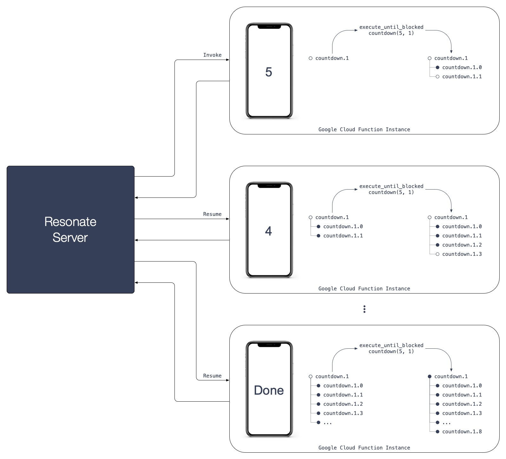
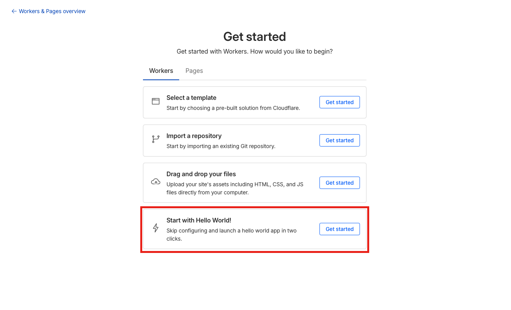
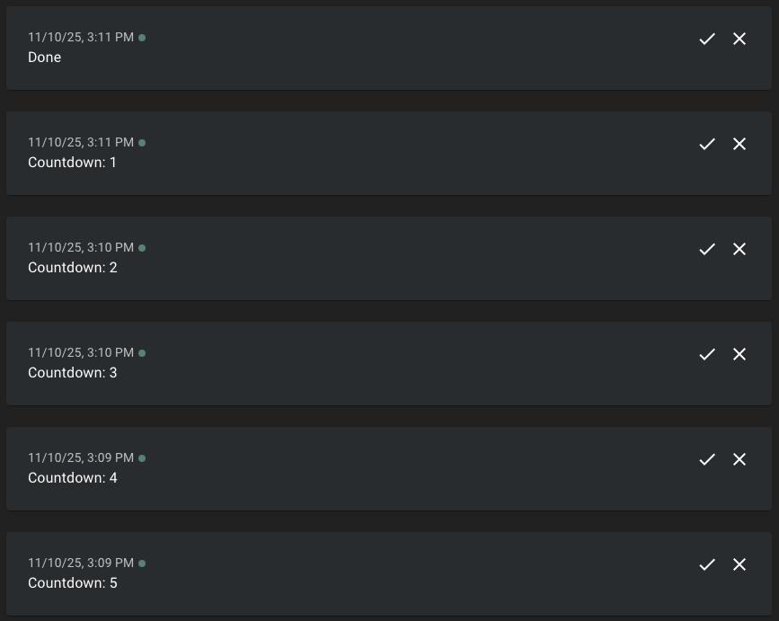

# Resonate Countdown on Cloudflare Workers

A *Countdown* powered by the Resonate Typescript SDK and Cloudflare Workers. The countdown sends periodic notifications to [ntfy.sh](https://ntfy.sh/) at configurable intervals.

## Behind the Scenes

The Countdown is implemented with Resonate's Durable Execution framework, Distributed Async Await. The Countdown is a simple loop that can sleep for hours, days, or weeks. On `yield ctx.sleep` the countdown function suspends (terminates), immediately completing the Cloudflare Worker execution. After the specified delay, Resonate will resume (restart) the countdown function by triggering a new Cloudflare Worker execution.

```typescript
export function* countdown(
	ctx: Context,
	count: number,
	delay: number,
	url: string,
) {
	for (let i = count; i > 0; i--) {
		// send notification to ntfy.sh
		yield* ctx.run(notify, url, `Countdown: ${i}`);
		// sleep creates a suspension point causing
		// the Cloudflare Worker execution to terminate
		yield* ctx.sleep(delay * 60 * 1000);
	}
	// send the last notification to ntfy.sh
	yield* ctx.run(notify, url, `Done`);
}
```

**Key Concepts:**

- **Suspension and Resumption:** Executions can be suspended for any amount of time
- **Stateful executions on stateless infrastructure:** Short-lived function instances executing one step of a long-lived execution coordinated by the Resonate Server.



---

# Running the Example

You can run the Countdown locally on your machine with Cloudflares's Wrangler Framework or you can deploy the Countdown to Cloudflare Platform.

## 1. Running Locally

### 1.1. Prerequisites

Install the Resonate Server & CLI with [Homebrew](https://docs.resonatehq.io/operate/run-server#install-with-homebrew) or download the latest release from [Github](https://github.com/resonatehq/resonate/releases).

```
brew install resonatehq/tap/resonate
```

### 1.2. Start Resonate Server

Start the Resonate Server. By default, the Resonate Server will listen at `http://localhost:8001`.

```
resonate dev
```

### 1.3. Setup the Countdown

Clone the repository

```
git clone https://github.com/resonatehq-examples/example-countdown-cloudflare-ts
cd example-countdown-cloudflare-ts
```

Install dependencies

```
npm install
```

### 1.4. Start the Countdown

Start the Cloudflare Worker. By default, the Cloudflare Worker will listen at `http://localhost:8787`.

```
npm run dev
```

### 1.5. Invoke the Countdown

The examples use ntfy.sh to send notifications. Create a unique channel name (to avoid receiving notifications from other users) and open the ntfy.sh channel in your browser.

```
echo https://ntfy.sh/resonatehq-$RANDOM
```

Start a countdown

```
resonate invoke <promise-id> --func countdown --arg <count> --arg <delay-in-minutes> --arg https://ntfy.sh/<channel> --target <function-url>
```

Example

```
resonate invoke countdown.1 --func countdown --arg 5 --arg 1 --arg https://ntfy.sh/resonatehq-17905 --target http://localhost:8787
```

### 1.6. Inspect the execution

Use the `resonate tree` command to visualize the countdown execution.

```
resonate tree countdown.1
```

Example output (while waiting on the second sleep):

```
countdown.1
├── countdown.1.0 🟢 (run)
├── countdown.1.1 🟢 (sleep)
├── countdown.1.2 🟢 (run)
└── countdown.1.3 🟡 (sleep)
```

## 2. Deploying to Cloudflare

This section guides you through deploying the countdown example to Cloudflare Platform using Workers for the countdown function.

### 2.1 Prerequisites

#### Resonate

Install the Resonate CLI with [Homebrew](https://docs.resonatehq.io/operate/run-server#install-with-homebrew) or download the latest release from [Github](https://github.com/resonatehq/resonate/releases).

```
brew install resonatehq/tap/resonate
```

#### Cloudflare Platform

Ensure you have a [Cloudflare Platform](https://www.cloudflare.com) account.

> [!WARNING]
> Cloudflare Platform offers extensive configuration options. The instructions in this guide provide a baseline setup that you will need to adapt for your specific requirements, organizational policies, or security constraints.

### 2.1 Create a Hello World Worker



### 2.2 Deploy the Resonate Server to Workers

Expose the Resonate server running locally to the cloud

**Step 1: [ngrok](https://ngrok.com) url**

```
ngrok http 8001
```

**Step 2: Run the server locally**

Configure the Resonate Server with its URL.

```
resonate dev --system-url <ngrok-url>
```

Example

```
resonate dev --system-url https://3d6a08125e17.ngrok-free.app
```

### 2.3 Deploy the Countdown to Workers

Paste the `wrangler.toml` at the root of this directory (replace the name with the name of your newly created worker)

```toml
name = "XXXXX-XXXXX-XXXX"
main = "index.ts"
compatibility_date = "2024-01-01"
```

Deploy it

```
npm run deploy
```

### 2.4 Invoke the Countdown

The examples use ntfy.sh to send notifications. Create a unique channel name (to avoid receiving notifications from other users) and open the ntfy.sh channel in your browser.

```
echo https://ntfy.sh/resonatehq-$RANDOM
```

Start a countdown

```
resonate invoke <promise-id> --func countdown --arg <count> --arg <delay-in-minutes> --arg https://ntfy.sh/<channel> --target $WORKER_URL
```

Example

```
resonate invoke countdown.1 --func countdown --arg 5 --arg 1 --arg https://ntfy.sh/resonatehq-22012 --target $WORKER_URL
```

### 2.5. Inspect the execution

Use the `resonate tree` command to visualize the countdown execution.

```
resonate tree countdown.1
```

Example output (while waiting on the second sleep):

```
countdown.1
├── countdown.1.0 🟢 (run)
├── countdown.1.1 🟢 (sleep)
├── countdown.1.2 🟢 (run)
└── countdown.1.3 🟡 (sleep)
```

## Troubleshooting

If everything is configured correctly, you will see notifications in your ntfy.sh workspace.



If you are still having trouble please [open an issue](https://github.com/resonatehq-examples/example-countdown-cloudflare-ts/issues).
